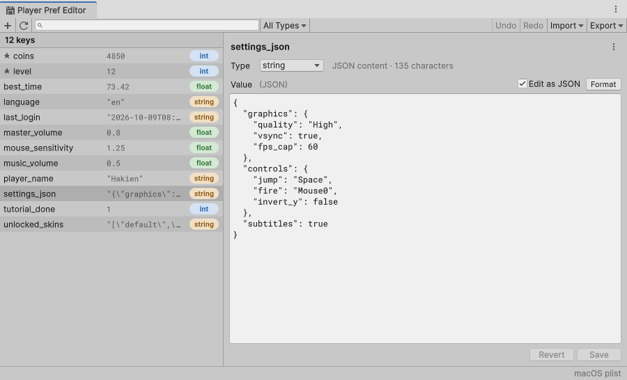

# kinatraa PlayerPref Editor

An Editor window for Unity's `PlayerPrefs`. Find, inspect, edit, rename, delete, import and export every value as formatted JSON (2-space indent), with undo for every change.

<picture>
  <source media="(prefers-color-scheme: dark)" srcset="Documentation~/images/window-dark.png">
  
</picture>

- **Every key on desktop Editors.** Keys are read from the OS store (registry, macOS plist, Linux prefs file), so values your game wrote are listed too, with their real type.
- **Find keys fast.** Live search over keys *and* values (plain text or regex), a type filter, sorting, pinned keys at the top, and a value preview column. Unity's own internal keys are hidden unless you ask for them.
- **Edit as JSON.** A monospace JSON editor with live validation and clear messages. Strings that hold JSON can be edited formatted and are stored back as strings. Changing the type converts the value when it can (`5` → `5.0` → `"5"`).
- **Undo and redo** for saves, renames, deletes, imports and Delete All, for the whole Editor session. When a value can't be restored, the window says so instead of pretending.
- **Import preview.** Every added, changed, removed and unchanged key with its old and new value. Pick rows, choose Merge or Replace, and apply as one undoable step.
- **Safe editing.** Unsaved edits survive script reloads and entering Play Mode, Unity asks before closing a window with unsaved edits, and a key that changes outside the editor while you edit it gets **Load Theirs / Keep Mine** instead of being overwritten silently.
- **Live in Play Mode.** The list refreshes while the game runs without stalling it, and game code can subscribe to `PlayerPrefEvents.Changed` to pick up values you edit.

It depends only on [Newtonsoft JSON](https://docs.unity3d.com/Packages/com.unity.nuget.newtonsoft-json@3.2/manual/index.html) (`com.unity.nuget.newtonsoft-json`), which the Package Manager installs automatically.

## Install

**Package Manager (git URL)**: *Window ▸ Package Manager ▸ + ▸ Add package from git URL…*

```
https://github.com/kinatraa/com.kinatraa.playerprefeditor.git#0.4.1
```

or add it to `Packages/manifest.json`:

```json
"com.kinatraa.playerprefeditor": "https://github.com/kinatraa/com.kinatraa.playerprefeditor.git#0.4.1"
```

Declared for Unity 2021.3 or newer; see [Compatibility](#compatibility-and-what-has-been-verified) for what has actually been tested.

## The window

**Tools ▸ kinatraa ▸ Player Pref Editor**

| Area | What it does |
|---|---|
| Toolbar | **+** new key, refresh, search, type filter and search options (**All Types ▾**), Undo, Redo, **Import ▾**, **Export ▾** |
| Key list | Keys with a value preview and a type pill, pinned keys (★) first. Shift/Ctrl/Cmd-click to multi-select. Right-click for key actions. |
| Editor | The key, its type, and its value as JSON. **⋮** holds Rename, Duplicate, Pin, Copy and Delete. **Revert** and **Save** sit at the bottom, like Unity's Revert / Apply. |
| Status bar | The result of the last action (with an icon for warnings and errors) and where keys are read from |
| Tab menu **⋮** | Auto Refresh in Play Mode, Show Unity Internal Keys, Delete All Keys…, Clear Undo History, Show Storage Location |

Drag the divider to resize the list; the width is remembered. Down to the minimum size of 460 × 280 nothing overlaps: the list narrows first, its preview column hides below 250 px, long names end in "…", and footer buttons wrap.

**Editing a key**

- The value field holds JSON: `5`, `0.8`, `"text"`. Typing text for a string without quotes shows a hint instead of a parse error.
- Errors appear in a red banner under the field with the line and position. Save stays disabled until the value is valid.
- **● Unsaved** in the footer and a `*` on the tab mark unsaved edits. **Revert** goes back to the stored value.
- Rename with **F2**, by double-clicking the key name, or from **⋮**. **Esc** cancels.
- If the key changes outside the editor while you have unsaved edits (Play Mode, a script, an import), a banner shows the new value with **Load Theirs** (drop your edit) and **Keep Mine** (keep it; Save then replaces the outside value without asking again).

**Large values.** Values over 100,000 characters open as plain text, and validation runs when you pause typing. You can still switch on **Edit as JSON**, which formats the whole value and is slower on multi-megabyte strings.

### Shortcuts (while the window has focus)

| Keys | Action |
|---|---|
| Ctrl/Cmd+S | Save |
| Ctrl/Cmd+F | Focus search |
| Ctrl/Cmd+N | New key |
| F2 | Rename |
| F5 | Refresh |
| Enter (in the list) | Jump to the value |
| Delete, or Cmd+Backspace (in the list) | Delete the selected keys |
| Ctrl/Cmd+C (in the list) | Copy the selected keys as JSON |

Rebind them under *Edit ▸ Shortcuts ▸ kinatraa*.

## JSON format

Export, Import and every Copy use one schema: an object that maps each key to its type and value.

```json
{
  "player_name": { "type": "string", "value": "Hakien" },
  "master_volume": { "type": "float", "value": 0.8 },
  "level": { "type": "int", "value": 5 }
}
```

| `type` | `value` must be | Example |
|---|---|---|
| `int` | a whole number from -2147483648 to 2147483647 (`5.0` is rejected) | `5` |
| `float` | a number, or `"NaN"`, `"Infinity"`, `"-Infinity"` | `0.8` |
| `string` | a JSON string in double quotes | `"Hakien"` |

**Strings that hold JSON.** When a string's content is a JSON object or array, **Edit as JSON** shows it formatted. Saving stores it back as a string: compact if the original was on one line, indented if it was multi-line. Untick it to edit the raw JSON string. Numbers inside are re-serialized, so `1.50` is stored as `1.5`.

Validation rules:

- A value is parsed before saving. Nothing is written while it is invalid.
- An import is checked in full before its preview opens. One invalid entry rejects the whole document. Duplicate keys and empty key names are rejected.
- Parsing uses Newtonsoft, which also accepts a few non-standard forms such as single-quoted strings and comments. Everything the tool writes is standard JSON.

## Import and export

- **Import ▾ From File…**, **From Clipboard**, or drop a `.json` file on the window. The preview groups rows as added, changed, removed and unchanged, with old and new values. Untick rows you don't want.
  - **Merge** adds and updates keys. Keys not in the import stay as they are.
  - **Replace** also deletes keys that are not in the import. Unity's internal keys are never deleted, and the import asks for confirmation before deleting anything.
  - If PlayerPrefs change while the preview is open, it refreshes when it regains focus. If they change right before you click Import, nothing is written and the preview shows the new state for you to review.
- **Export ▾** writes all keys, the keys matching the current search and filter, or the selected keys to a file, or copies them to the clipboard.
- **⋮ ▸ Delete All Keys…** deletes every listed key. Internal keys are deleted only while they are shown.

Keys of unknown type can't be exported (their value can't be read). Export, Copy and the status bar say how many were left out.

## Undo

Every change made in the window, or through `PrefHistory` in your own scripts, is one undo step. History lasts until Unity closes and survives script reloads.

A value whose type couldn't be detected can't be read, so its old value can't be restored. The window warns before replacing or deleting such a key, the import preview counts them, and if an Undo or Redo hits one, the status bar names the keys it could not restore.

Undo writes the earlier value back even if the key changed again outside the editor after that step.

## React to edits in Play Mode

Saving in the window writes straight into the PlayerPrefs your game reads, so the next `PlayerPrefs.GetInt` returns the new value. Code that read a value once and cached it won't notice on its own. Subscribe to `PlayerPrefEvents.Changed` to re-read it:

```csharp
using kinatraa.PlayerPrefEditor;
using UnityEngine;

public class Settings : MonoBehaviour
{
    float _volume;

    void OnEnable() => PlayerPrefEvents.Changed += OnPrefChanged;
    void OnDisable() => PlayerPrefEvents.Changed -= OnPrefChanged;
    void Start() => _volume = PlayerPrefs.GetFloat("master_volume", 1f);

    void OnPrefChanged(string key)
    {
        if (key == "master_volume") _volume = PlayerPrefs.GetFloat("master_volume", 1f);
    }
}
```

- It fires once per changed key after the change is saved: Save, Rename (old and new key), Delete, Import, Delete All, Undo and Redo. A deleted key fires too, so always read with a default.
- It runs on the main thread, in Edit Mode as well as Play Mode. A handler that throws is logged and does not affect the change or other handlers.
- It only fires for changes made through this package, not for `PlayerPrefs.Set*` calls in your own code.
- Handlers are cleared when Play Mode starts, including with domain reload disabled, so subscribe in `OnEnable` or `Start`.
- In builds the event exists but never fires, so you can leave the subscription in shipping code.

With **Auto Refresh in Play Mode** on (the default), the list re-reads PlayerPrefs about once a second while the game runs. The OS store is read on a worker thread, so the game does not stall.

## Platform support and known limitations

Unity has no API that lists PlayerPrefs keys, so keys are read from where the Editor stores them:

| Editor platform | Location |
|---|---|
| Windows | Registry: `HKCU\Software\Unity\UnityEditor\<companyName>\<productName>` (builds use `HKCU\Software\<companyName>\<productName>`) |
| macOS | `~/Library/Preferences/unity.<companyName>.<productName>.plist`, read through `defaults` |
| Linux | `~/.config/unity3d/<companyName>/<productName>/prefs` and `~/.local/share/unity3d/<companyName>/<productName>/prefs` (both are read) |

`companyName` and `productName` come from **Project Settings ▸ Player**; changing them moves the Editor to a new PlayerPrefs location. **⋮ ▸ Show Storage Location** reveals the file (macOS, Linux) and copies the path.

- The Editor keeps PlayerPrefs in memory and writes them to the OS store when they are saved. A key set in Play Mode appears once the game calls `PlayerPrefs.Save()` (or Unity saves on exit). Keys written through this tool are always listed: they are also remembered in a per-project list in `EditorPrefs`.
- Changing the OS store from outside Unity (for example with `defaults write`) is not seen by the running Editor's PlayerPrefs, and such keys are not listed.
- If the OS store can't be read, the status bar shows **Tracked keys only** with the reason in its tooltip, and the window lists the keys written with this tool. To show another existing key, click **+**, enter its name and **Save**, then choose **Open Existing**.

**Type detection is best-effort.** PlayerPrefs has no API that returns a key's type. Each key is read with two different defaults per getter (`GetInt`, `GetFloat`, `GetString`); a getter that answers both times holds the value. If exactly one answers, that is the type. If several answer, the OS store's type decides, but only when its getter answered too. Otherwise the key is shown as **unknown**: its value can't be read, and Save asks before replacing it.

## Compatibility and what has been verified

| | Status |
|---|---|
| Unity 6 (6000.3) on macOS, Dark and Light themes | Tested: the test suite, scripted runs through the window at five window sizes, Play Mode with and without domain reload, and a player script compile |
| Windows Editor | Not run yet. The registry reader is compiled only on Windows; its name parsing is unit-tested on macOS |
| Linux Editor | Not run yet. The prefs file parser is unit-tested |
| Unity 2021.3–2023.x | Not tested. The code avoids newer UI Toolkit APIs or guards them with version checks, but has only been compiled with Unity 6 |

**What ships in builds.** The window and all editing code are in an Editor-only assembly. Player builds get one tiny runtime assembly, `kinatraa.PlayerPrefEditor`, holding `PlayerPrefEvents`. The Newtonsoft package this depends on marks its AOT `Newtonsoft.Json.dll` for player builds; that is the Newtonsoft package's own setting, and managed code stripping can remove it if nothing in your game uses it.

## Scripting

The window is built on public Editor classes you can call from your own Editor scripts:

```csharp
using kinatraa.PlayerPrefEditor;

// Undoable from the window's Undo button.
PrefHistory.instance.Commit("Reset progress",
    new[] { new PrefEntry("level", PrefType.Int, 1) },   // writes
    new[] { "checkpoint" });                              // deletes

PrefEntry e = PlayerPrefStore.Read("level");              // e.Type == PrefType.Int, e.Value == 1
List<string> keys = PlayerPrefStore.GetKeys();
string json = PlayerPrefStore.ExportJson(out int exported, out int skipped);

if (PrefJson.TryParseDocument(json, out var entries, out var error))
    ImportPreviewWindow.Open("backup.json", entries, message => Debug.Log(message));

PlayerPrefEditorWindow.Open();
```

`PlayerPrefStore.Write`, `Apply`, `Delete` and `Commit` change PlayerPrefs directly, without undo.

## Samples

Import **Basic Usage** from the package's page in the Package Manager. It contains `sample-playerprefs.json` to try Import with.

## License

[MIT](LICENSE) © kinatraa
